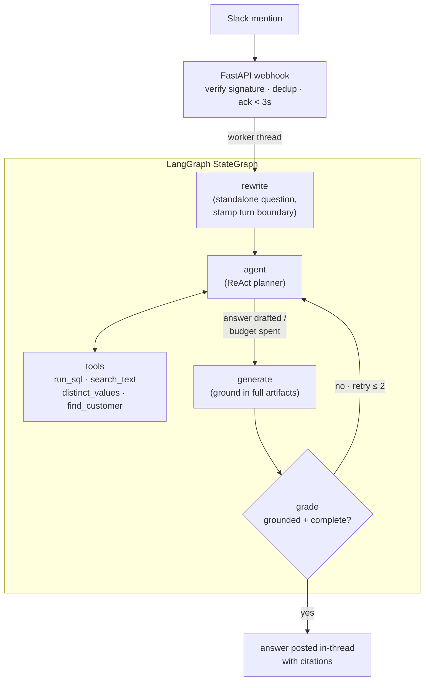

# Slack-Chain QA Bot

This is the design behind a Slack bot that answers free-form questions about the Northstar company, strictly from a SQLite knowledge base of customer calls, support tickets, internal docs, competitor research, and the relational scaffolding around them. Examples of questions include: which customer's issue started after the taxonomy rollout?", "what's the approved patch window for Verdant Bay and how do we roll back?". All the answers must be derived from existing data and shouldn’t be made up.

This document discusses the design I chose and the reasoning behind it along with tradeoffs, production replacements and future improvements.

## Expected requirements

1. The bot has to only be able to pull from the read-only Knowledge base, ground every factual claim in what it has retrieved and cite the sources.
2. Should handle follow ups in a thread like “what about their renewal?” after a question regarding a company’s contract. Multi turn conversations along with long threads.
3. Should refuse to answer when it doesn’t have enough information to answer that question instead of hallucinating.
4. Slack doesn’t support streaming and has a unique 3s process after which it retries. This must be addressed to improve UX and perceived latency.

A few things I decided upon after looking at the data and the problem:

- This is not a write agent, so the DB should be strictly read-only. The Knowledge base is also on the smaller side and relational, so it would not require embeddings and vector stores unless the artifacts or unstructured data scales. An SQL plus a FTS5 full-text index is both faster and more precise than nearest-neighbor retrieval, and it makes grounding more reliable. Assumes KB is accessible to all the employees, else would require Access aware retrieval based on the channel and members.

## The Shape of the system

## Web Layer

Because of Slack’s 3 second rule where if it does not get a 200 OK it keeps retrying, I decided to go with a acknowledge then process approach. Here after we get the request from slack to our URL, we do the minimum needed to accept the request i.e verify, dedup and hand off to a worker thread and send the OK to slack, while the slow LLM/ retrieval work runs in the background thread. I chose the Events API over Socket Mode specifically so the signature verification is real, on the request path, and testable. Socket Mode while a great option for development would have hidden that boundary. A placeholder keeps updating the progress during the background work.

## The Graph Runs 5 nodes per question

| Node | What it does |
|---|---|
| `rewrite` | Turns a follow-up question into a standalone question ("their pricing" to "Acme's pricing") using thread the history, stamps the turn boundary and resets the per-turn tool budget and retry counter. Runs only once per turn. |
| `agent` | The planner which is a ReAct loop where gpt-4o decides which tools it needs to call and in what order. The model plans its own retrieval. |
| `tools` | Executes the 4 retrieval tools (mentioned in next section). Hard stop at 14 executed calls per turn, past that the graph answers from what it already has. |
| `generate` | Writes the final answer, but first force-fetches the full `content_text` of up to 5 retrieved artifacts and grounds the answer in their complete sources, not search excerpts. If the agent already produced a well-formed answer and there's no fuller content to add, it keeps that answer untouched. |
| `grade` | A typed (Pydantic) verdict with two booleans: grounded (every claim supported by the evidence) and complete (every part of the question answered and every member of a requested set listed). On failure, it gives feedback that goes back to the agent for another retrieval pass, at most 2 retries. |

### Why do we have a custom graph when the prebuilt ReAct agent scores the same on the eval?

The graph adds what a deployment needs and the prebuilt one lacks i.e. follow-up rewriting, an enforced tool budget, the full-text grounding step, and the grade check with retry. All routing decisions are typed; there is no regex over model output anywhere in the control flow, so rewording a prompt can't silently break routing.

Two grading rules that shape the edge behavior:

- An honest "I couldn't find that" counts as grounded answer, but only counts as complete if the evidence shows retrieval for that thing genuinely came up empty. The grader sees how much of the 14-call tool budget was used, so "couldn't find the answer" with 10 calls unspent gets sent back with instructions on what to retrieve next.
- When the char evidence window fills, it keeps the most recent tool results, not the first ones. Retrieval converges toward the answer, the late calls hold the decisive reads, the early ones are exploration dumps.

## The four retrieval tools

| Tool | What it returns | Caps |
|---|---|---|
| `run_sql(query)` | Rows from the one read-only SELECT. The primary tool used: the KB is relational, so navigation is joins. Long-text columns (`content_text`) are not truncated, reading whole documents is the point. On a bad table/column name, the error comes back with a compact table(columns) catalog so the agent fixes its query in one retry. | 100 rows, 12k chars, 5s timeout |
| `search_text(query, k)` | The Top-k artifacts (id, type, title, owning customer, excerpt) from the FTS5 keyword search, bm25-ranked. This is the discovery tool for "which entity matches this described situation?" | k ≤ 20, 1,200 char excerpts |
| `distinct_values(table, column)` | The real stored values of a column, with row counts. | top 50 by frequency |
| `find_customer(term)` | The 5 closest customer names with fuzzy-match scores, tolerant of spacing, punctuation, casing, typos. | always returns candidates |

The design decision behind the last two was when the agent keeps doing the wrong thing, give it a capability, not a prompt fix (over fitting). Both tools exist because of observed failures. The agent used to guess categorical filter values from the question's wording (`pain_point LIKE '%approval-bypass%'` when the stored value says "approval workflow failures…"), got zero rows, and concluded the thing didn't exist; roughly five attempts to fix that with prompt rules either didn't take or destabilized passing cases. `distinct_values` fixed it immediately: the agent now looks up the real categories and filters on one. Same story for customer-name resolution: "blue harbor" silently missed BlueHarbor Logistics under LIKE, so `find_customer` does fuzzy resolution.

The single biggest efficiency gain is none of the tools, it's the full schema in the system prompt. The model never spends calls rediscovering tables and columns; typical questions resolve in 3-6 calls. The prompt also carries the navigation rules that encode known failure modes: never keyword-filter `content_text` or `title` (document wording rarely matches question wording), attribute facts to an artifact's owning customer via foreign key, never via a name appearing in the prose, and `scenarios` has no `customer_id` column. The FK direction is `customers.scenario_id` to `scenarios`, and guessing wrong is dangerous because SQLite resolves an unknown column in a correlated subquery against the outer query, silently matching every row instead of erroring.

## Multi-turn: bounded context, per-turn budgets

Concretely, on every turn which the model sees the system prompt, previous turns as a Q/A skeleton (user questions + final bot answers only, capped at the 12 most recent messages, all old tool traffic and reviewer feedback dropped), and the current turn in full. Evidence for generate/grade, the artifact ids for the grounding fetch, the 14-call tool budget, and the 2-retry counter are all scoped to the current turn, reset by `rewrite`.

Thread state persists in SQLite via LangGraph's `SqliteSaver`, so conversations survive restarts, `PostgresSaver` is the production swap.

Why the bounding exists? the naive version replayed the entire accumulated history every call. On long threads that grew the prompt without bound, and it caused two concrete bugs: stale artifact ids from old turns crowded the current turn's 5-slot grounding fetch, and the thread-wide tool count meant turn three of a conversation arrived with its budget already "spent" and its grader disabled. The skeleton cap is by message count (~10-15k tokens worst case), which is O(1) in thread length, a token-based budget is the next step of the solution if cost ever increases due to scale.

## Security boundaries

Three, each with a defined mechanism:

1. For Model-generated SQL, Two independent layers: the SQLite connection is opened with `mode=ro` (the driver cannot write, full stop), and before execution every query is parsed with sqlglot and rejected unless it is a single SELECT. This is an AST allowlist, and it also blocks PRAGMA, ATTACH, and multi-statement payloads, which a read-only connection alone would permit. `distinct_values` validates table/column names against the live catalog before interpolating them.
2. For Inbound Slack traffic: Signature verification (HMAC, constant-time comparison, timestamp freshness window) runs on the request path before anything else, duplicate deliveries are dropped by event id with a TTL cache.
3. The KB content itself: Artifact text is treated as reference data, never as instructions. This is stated explicitly in the prompt, because a corpus of customer transcripts is exactly where a prompt-injection attempt would live.

## The Eval Harness

The harness has 16 cases run as a LangSmith experiment: the 7 provided example queries, 5 authored cases (structured lookups plus an honest-refusal case), and 4 held-out cases. Prose answers are scored by a gpt-4o-mini judge against a per-case rubric, gated by a deterministic substring anchor (the judge can't pass an answer missing a required fact). Structured lookups are exact substring checks. Refusal cases are judge-scored against a refusal reference, fabricating a number fails.

### The gates

| Gate | Value | Why this form |
|---|---|---|
| Overall accuracy | floor: ≥ 70% | The eval is stochastic (LLM agent + LLM judge); comparing one run to a stored baseline with noise-sized tolerance which fires on noise. A floor doesn't. |
| Held-out accuracy | floor: ≥ 70%, own gate | The 4 held-out cases use the same methods as the tuned cases but data the prompt was never tuned against to mitigate bias. They're the overfitting tripwire, memorize a tuned case and the twin regresses. |
| Total tool calls | ratchet: ≤ baseline × 1.3 (baseline 41) | The one low-variance metric (an all-case sum), so a real efficiency regression stands out. |
| Judge temperature | pinned to 0 | At the default, the judge failed the same correct answer every 1 time in 6, producing phantom accuracy variance that had nothing to do with the agent. |

Current numbers: 16/16 accuracy, 4/4 held-out, in repeated full runs; the prebuilt-agent fallback also scores 16/16 with the same tools(occasionally varies to 15/16 due to non-determinism). The project started at 58%, scoring 7 of the original 12-case harness (the 7 example queries plus 5 authored lookups; the held-out set came later). Most of the gain came from retrieval changes (full-text reads, explore-first tools, FK attribution), not prompt wording.

CI runs lint/type/test on every PR and push to main, and the eval as a regression gate on PRs, main is protected (PR + green CI required, no direct pushes).

## Limitations

- Stochastic system, stochastic eval. 16/16 is the current repeated result, not a guarantee; individual cases can flip run to run, which is exactly why the gates are floors and a ratchet rather than exact-match comparisons.
- Retrieval is keyword + relational only. Right at this corpus size, if at 100x growth, add embeddings over artifact chunks, keeping the FK-attribution rule so grounding stays auditable.
- Grounding fetch caps at 5 artifacts. "Summarize everything about account X" can exceed it, the fix would be pagination or map-reduce summarization, not a bigger cap.
- Single tenant, single SQLite KB. Production: Postgres checkpoints (one-line swap) and the KB behind a service boundary.
- History bounded by message count, not tokens. Worst case 10-15k tokens of skeleton, fine for scope, token-budgeted tomorrow if cost is an issue.
- Gpt-4o-mini as judge for 4o is a little optimistic, might consider switch to a better or different model family.

## Future Improvements

- **Redis work queue:** Ack the webhook fast, enqueue the question, let workers handle it, so crashes and deploys stop eating questions and bursts stop spawning unbounded threads.
- **Redis dedup + rate limits:** The current dedup cache is per-process, so two replicas would both answer the same mention. SET NX fixes that and rate limits ride on the same instance.
- **Postgres replacements:** Checkpoints swap to PostgresSaver, KB moves behind a pooled read replica.
- **KB ingestion pipeline:** The data is a frozen file today; production needs CRM/ticketing syncs, FTS reindexing, and migrations.
- **Online eval:** Sample live Q&A, score it with the same judge, and watch grade-retry / budget-exhaustion / refusal rates as drift alarms.
- **Feedback buttons.** A thumbs down button captures question + answer + trace, and that pile becomes new eval cases.
- **Cost tiering:** Route easy lookups to gpt-4o-mini, keep gpt-4o for the hard stuff, let the eval floors prove it's safe.
- **Degraded mode:** Circuit-break on provider outages, queue the questions, tell the user honestly instead of timing out.
- **Access control:** Channel-to-scope mapping enforced as a SQL filter in the tool layer, never as a prompt instruction.
- **Real secrets management:** Tokens in a vault with rotation, separate Slack apps per environment so staging can't post to prod.
